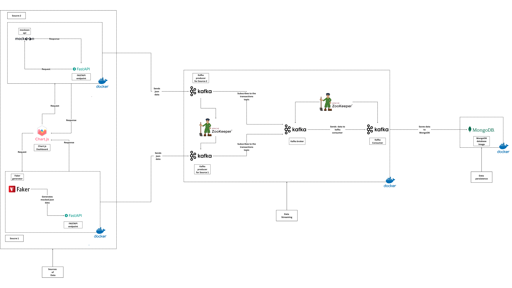

# Real-Time E-commerce Transaction Pipeline

This project demonstrates a complete, end-to-end real-time data pipeline designed to simulate and process e-commerce transactions. It captures data from multiple sources, streams it through Apache Kafka, and stores it in MongoDB for persistence and future analysis.

## 🏛️ Architecture

The entire system is designed with decoupled services, making it scalable and resilient.



---

## ✨ Features

- **Real-Time Data Streaming:** Utilizes Apache Kafka as a high-throughput, distributed message broker.
- **Multiple Data Sources:** Ingests data from two independent sources:
  - A **Faker**-based generator for producing realistic, mocked JSON data (`producer` service).
  - A **Mockoon** API simulator, mimicking a real-world third-party API (`producer-mockoon` service).
- **Decoupled Services:** Each component (producer, consumer) runs as a separate service, communicating only through the Kafka message bus.
- **FastAPI Producers:** Python-based Kafka producers are exposed via high-performance FastAPI endpoints.
- **Persistent Storage:** A Kafka consumer subscribes to the data stream and saves all incoming transactions to a **MongoDB** database.
- **Data Visualization:** Includes a **Chart.js** dashboard (`users_transactions_over_time` service) to demonstrate front-end consumption of the data.
- **Containerized Environment:** The entire stack is managed with Docker and Docker Compose for easy, one-command setup.

---

## 🛠️ Tech Stack

| Component                    | Technology                                                                                                                                                                                                                                                |
| ---------------------------- | --------------------------------------------------------------------------------------------------------------------------------------------------------------------------------------------------------------------------------------------------------- |
| **Data Streaming**     |   |
| **Database**           |                                                                                                                                                     |
| **Backend / Services** |                                                  |
| **Mocking / Data Gen** |                                                                                |
| **Frontend**           |                                                                                                                                                |
| **Containerization**   |                                                                                                                                                        |

---

## 🚀 Getting Started

Follow these instructions to get the project up and running on your local machine.

### Prerequisites

- [Git](https://git-scm.com/)
- [Docker](https://www.docker.com/products/docker-desktop/)
- [Docker Compose](https://docs.docker.com/compose/) (usually included with Docker Desktop)

### Installation & Setup

1. **Clone the repository:**
   ```bash
   git clone https://github.com/amineelgardoum-rgb/transactions_e_commerce_pipeline.git
   cd transactions_e_commerce_pipeline
   ```

---

## 🏃‍♀️ Running the Project

The entire infrastructure can be launched with a single command thanks to Docker Compose.

1. **Start all services:**
   Run this command from the root of the project directory. The `-f` flag specifies the correct compose file, and `--build -d` will build the images if they don't exist and run the containers in detached mode.

   ```bash
   docker-compose -f docker-compose.project.yml up --build -d
   ```

   This will start:

   - Kafka and ZooKeeper
   - MongoDB
   - Two FastAPI producer services
   - The Kafka consumer service
2. **Verify the services are running:**
   To check the status of all containers:

   ```bash
   docker-compose -f docker-compose.project.yml ps
   ```

   To view the real-time logs from all services:

   ```bash
   docker-compose -f docker-compose.project.yml logs -f
   ```    Press `Ctrl + C` to exit the logs.

   ```
3. **Interact with the APIs:**

   - **API Docs:**
     - **Source 1 (Faker):** [http://localhost:8000/docs](http://localhost:8000/docs)
     - **Source 2 (Mockoon):** [http://localhost:8001/docs](http://localhost:8001/docs)
      
**4.Check the data in MongoDB**:
</br>
      You can connect to the MongoDB instance with a GUI client (like MongoDB Compass) or use the Docker container's shell:
4. 1. **Enter the MongoDB shell:**
</br>
      ```bash
      docker-compose -f docker-compose.project.yml exec mongo mongosh
      ```
   2. **Show databases:**
</br>
      ```bash
      show dbs
      ```
   3. **Use the correct database:**
</br>
      ```bash
      use mocked_data
      ```
   4. **View the data:**
</br>
      ```bash
      db.transactions.find()
      ```
</br>
5. **Stop the services:**
   To stop and remove all the running containers:

   ```bash
   docker-compose -f docker-compose.project.yml down
   ```

   To **also remove the data volumes** (deleting all MongoDB data):

   ```bash
   docker-compose -f docker-compose.project.yml down -v
   ```

---

## 📁 Project Structure

This file structure matches the one you provided.

```
.
├── archi/                        # Contains architecture diagram images
├── consumer/                     # Kafka consumer service (writes to DB)
├── mockoon/                      # Configuration for the Mockoon API simulator
├── producer/                     # Kafka producer service for generating data
├── producer-mockoon/             # Kafka producer service for the Mockoon source
├── users_transactions_over_time/ # Frontend dashboard application
├── .dockerignore                 # Files for Docker to ignore
├── .gitignore                    # Files for Git to ignore
├── docker-compose.project.yml    # Main Docker Compose file
└── README.md                     # You are here!
```
